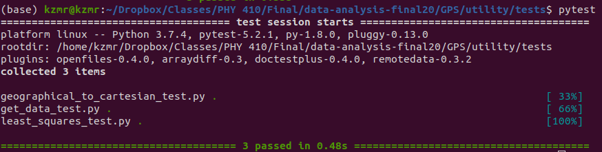

## CODE

***

### Purpose

The goal of the file is to expand on the code found in the `utility` folder, as well as their related unit tests.  Ideally, it will explain to you why the code is as it is, why I ignored specific cases, and why I tested what I did.  It will be broken into two sections:  `utility` and `tests`, to reflect the folders that the code can be found in.

Consider that all of these codes have documentation already, but putting that information all in one place may be useful to the user.  


### Utility

#### _get_data_

The purpose of this code is to take in `phyphox` code such that it returns metrics that we find particularly useful for this experiment.  See `Data` in the wiki for these exact metrics.  

There are three imported libraries here:  `os`, `pandas`, and `numpy`.  First, `os` is used to check if files exist and whatnot.  Then,  `pandas` is used to load `CSV` files into their dataframe object such that we can operate on it.  Lastly, `numpy` is for its vectorization such that we can convert `pandas` dataframes to vectorized code.

Further, the only function in this `.py` is `get_data()`, which takes in `filename` as a string and has a flag `ignore_zeros as a Boolean.`  The filename must exist in the current directory, otherwise it'll return an empty dictionary.  This is seen by the following code:

```python
position = {}

...

if os.path.exists(filename):
        
        table = pds.read_csv(filename)
        
        ...
        
...

return position
```

Effectively, if this Boolean isn't evaluated as true (that the path exists), then the `position` variable remains empty and gets returned at the end.  This way, the code can still operate if the file doesn't exist.  In legitimate code, there would exist some sort of catch statement to see if the dictionary is empty.  The same can be said if the data is not formatted correctly.  Within the first if statement is a second if statement such that

```python
if keys == list(table.keys()):
    
    ...
```

such that

```python
keys = ['Time (s)', 'Latitude (°)', 'Longitude (°)', 'Altitude (m)',
       'Altitude WGS84 (m)', 'Speed (m/s)', 'Direction (°)', 'Distance (km)',
       'Horizontal Accuracy (m)', 'Vertical Accuracy (m)', 'Satellites']
```

Basically, if the data isn't formatted exactly as the `phyphox` GPS experiment, then we treat it as if it's not correct data.  This may be an issue if the user opts to format the data differently than it's originally output.  Then, if `ignore_zeros == False`,  we filter the dataframe such that the zero satellite entries cannot be trusted.  As such

```python
 if ignore_zeros == False:
         
 	table = table[table['Satellites'] != 0.0]
    
 ....
```

This tells the user where every entry exists in the table such that there are at least one satellite, then uses that set of indices to reduce the dataframe down.  There is an explanation in `Data`, but effectively sometimes the experiment defaults to the phone's last known location, as opposed to GPS data.  If all of those checks succeed, then the data is stored in the `position` variable and it's returned.  No need to elaborate on that, as most of that is done in `Data` already. 

#### _geographical_to_cartesian_

Once the data has been pulled from `phyphox`, the user has the option of looking at the geographical coordinates or, more commonly, looking at the Cartesian coordinates.  This `.py` does just that.   Consider that `numpy` is the only imported library and this is to perform vector operations.  Realistically, I could call `get_data.py` from inside this script, requiring its imports as well, but I felt it made sense to keep them separate, in case the user had other coordinates outside of the data to convert.

Along the same lines, I only convert from geographical to Cartesian and not the other way around.  To me, geographical coordinates are effectively useless in a physics discussion meant to be understood by a novice.  Regardless, there is one function here called `convert_coordinates()` that takes in `latitude`, `longitude`, and `altitude`, which can be any variation of a float or int.  Or, more usefully due to `numpy`, an array or vector of these data types.

The first thing that it does is to redefine `z` by

```python
z = np.array(altitude)
```

This is fairly unnecessary; I could hypothetically just package `altitude` in at the end, instead of `z`, since no transformation is performed.  However, it is an opportunity to convert the data from whichever data type it was to a `numpy` array.  If it were, say, a Python list, then vector operations could not easily be performed without extra iterative loops. 

I then convert `latitude` and `longitude` to radians by virtue of 

```python
rad_lat = np.array(latitude)*np.pi/180

...

rad_long = np.array(longitude)*np.pi/180
```

because the data from `phyphox` is in degrees and, more commonly, latitude and longitude are expressed in those measurements.  The vectorization here is for the same reason as above.

Lastly, to derive the radius I apply

```python
r = z/np.sin(rad_lat)
```

This is fine in most cases since we know both `z` and `rad_lat` indiscriminately.  However, it is important to consider that if `rad_lat = 0`, then the function will evaluate to infinity.  There are places on Earth such that this occurs, namely the Equator, but for our purposes I'm willing to assume that none of my data will come close to that region such that I don't have to take it into consideration.  If someone from that area, does, however ... well, they would just have to modify the code to introduce a new variable or an if statement to reduce `r` to the appropriate value.

The rest of the code is just applying the transformations laid out in `Theory` and then storing them in a dictionary.  I do this, as it is easier to keep track of than separating the three coordinate variables.  Would you carry, say, three small luggage or one larger one, containing the contents of the three? Exactly.

#### _least_squares_

With the data in a conveyable format, it can be fit.  This is the purpose of `least_squares.py`.  In it, the only import once again is `numpy`, for the vectorization of code.

However, this `.py` actually has three functions, all related to least squares as defined in `Theory`.  The first is `least_squares()`, which takes in `ds`, the output, `t`, the input, and a flag `n`, which describes which order polynomial the system is being fit to.  The vectors have to be of a numerical type; strings and the like are disallowed.  In it, we primarily define matrices and vectors as they're described in `Theory`.  For example

```python
T = np.zeros((ds.shape[0], n + 1))
    
...

for idx in range(n + 1):
    T[:,idx] = t**idx
```

creates an array `T` of a size corresponding to the length of the input (or output) and the order polynomial (an $n$-th order polynomial would have at most $n + 1$ terms).  We then iterate over the total possible number of terms to generate a vector $t^{idx}$, which corresponds to the input raised to some power $p \in \{0, 1, ..., n\}$.  Since `t` is a vector, raising it to a power applies that power to all terms.  This won't change the shape of the data, so it fits right into `T`.  We do this until at the $n$-th order term.  We then take advantage of the transpose such that

```python
A = T.T @ T
b = T.T @ ds
```

These correspond to variables in `Theory`, as always.  Basically, the `.T` suffix in `numpy` produces the transpose of that vector or matrix, whereas the `@` operator is the equivalent of `np.matmul(T.T, T)` or `np.matmul(T.T, ds)`.  The shorthand is easier to write out and nicer to look at.

Lastly, we just

```python
return np.linalg.solve(A, b)
```

 which performs Gaussian elimination on square matrix `A` and vector `b`.  This returns our coefficients of length `n`.  

The next function is `chi2()`, which takes in `actual`, the actual data, `predicted`, the results of the least squares fit, and `std`, a vector of the standard deviations associated with the measurements of the actual data.  If there is no standard deviation data available, the user may opt to set it as $1$ or approximate what they would anticipate.  Effectively, it is used to tune the results such that the more accurate measurements have higher weight.   This also follows the definitions laid out in `Theory`, but to surmise:

```python
difference = actual - predicted

...

division = difference/std

...

return np.sum(division**2)
```

Basically, `difference` is the error in the fit.  The order of subtraction doesn't matter, since the term will be squared in the end.  `division` is just dividing `difference` by `std` such that areas of high measurement error are disregarded in favor of accurate measurements.  Finally, we just return the terms squared and summed, using `numpy`'s vectorization.  Overall, `chi2` is just a means of displaying total error.

The last function is a derivative (not calculus) of `chi2`:  `rmse`.  This function takes in the same parameters, but instead returns what is defined in `Theory`.  The code is also simple such that

```python
goodness_of_fit = chi2(actual, predicted, std)

...

return np.sqrt(goodness_of_fit/actual.shape[0])
```

 We reference `chi` here as `goodness_of_fit` based on the equation presented.  This just saves us from repeating code.  More importantly, we return the square root of `goodness_of_fit` divided by `actual.shape[0]`, which effectively is the 0-axis length.  For a vector, this is just the total number of elements.  This will return a float or an adjacent data type.  

Preference between the two functions is arbitrary; some scientists prefer `rmse` whereas others prefer `chi2`.  There are, of course, other measures of error, but these are the most common for fitting data.  Both are provided by means of preference.


### Tests

#### _get_data_

The unit tests for this `.py` focus primarily on three cases:  nonexistent data, incorrectly formatted data, and correct data.  It also checks the types such that it agrees with what I've been saying.  

Aside from importing the main `.py` function, this also imports `sys` in order to append the `utility` folder.  This is true for all of the unit tests.  Also note that all of the testing functions are just prefixed with `test_` with respect to the main function of that file.  In the case of `least_squares`, `test_least_squares`.  You get the point. 

The first test is meant to show that nonexistent data returns an empty dictionary such that

```python
empty_results = get_data('obviously wrong filename.csv')
assert not empty_results
```

If you check the data, there is no file by this name.  So, the code should return an empty dictionary.  This is what `assert not` implies, that the data structure contains nothing.

Then, I look at the case where the data is not compatible for this experiment

```python
wrong_results = get_data('../../data/corrupted_sample.csv')
assert not wrong_results
```

Namely, the imported `.csv` is older data with the time column removed, so it should also return an empty dictionary.

After that, the most sensible case is when the data is real and legitimate.  This is just

```python
real_results = get_data('../../data/sample_1.csv')
assert real_results
```

You can look directly at this files to confirm.  The `assert real_results` is just stating that there are elements in the dictionary.  

As a bonus, I also confirm that the data structures are all dictionaries, independent of the Boolean checks such that

```python
assert(type(empty_results) == dict)
assert(type(wrong_results) == dict)
assert(type(real_results) == dict)
```

where `type()` returns the type of the input.  `dict` is just the type for the native Python dictionary.  I suppose you could also confirm that the keys of the dictionary are analogous to the table, but consider that I change the naming such that they're more easily indexed.  Especially since the degree symbol is not the easiest to type.

#### _geographical_to_cartesian_

For this `.py`, we also import `numpy` for its vectorization.  The tests here primarily compose of a scalar example and then showing that the functions vectorize.  First, 

```python
r, theta, phi = 1, 90, 0

cartesian_coordinates = convert_coordinates(theta, phi, r)
    
...

assert(type(cartesian_coordinates) == dict)

...

assert(round(cartesian_coordinates['x'], -16) == 0)
assert(round(cartesian_coordinates['y'], -16) == 0)
assert(cartesian_coordinates['z'] == r)
```

This example is basic.  This effectively means that the vector is pointing straight upwards, as in $r$ aligns with $z$ . So, we would anticipate $x = y = 0$, but $z = r = 1$.  This is to just show that individual results can be passed in as well as vectors.  I also assert the type like last time, just to reassure that it will be a `dict` every time.  Note that I round according to machine precision because sometimes the sinusoidal functions don't behave correct for small values.

Then, 

```python
rs = np.linspace(0, 1, 1000)

vector_cartesian_coordinates = convert_coordinates(theta, phi, rs)

...

assert(type(vector_cartesian_coordinates['x']) == np.ndarray)
```

Effectively, I define a vector of radial values such that I can pass it into the function.  This should return a dictionary containing vectors now, which it does.  I could have said that `vector_cartesian_coordinates['z'] == rs`, but that becomes an issue due to stuff like machine precision.  So, I just opted to show that it is a `numpy` array, as opposed to a scalar.  

Other tests that could've been included might have been the case where $theta = 0$, but I didn't account for that in the code, as it represents a latitude of zero degrees, or along the equator.  So, we just assume that nobody along the equator will use this.  Besides, `phyphox` data is inaccurate enough such that perhaps it would never measure 0 degrees properly.  I could've also asserted that the type in the scalar case is a `numpy` float, but the assumption is there by only comparing the vectors components to scalars themselves.

Regardless, the unit testing for this is limited because there is not much that could be done.

#### _least_squares_

This test also imports `numpy` for the same reasons as above.  Here, I primarily showcase that `least_squares` approximates functions well.  For example

```python
x = np.linspace(0, 10, 1000)
y = x**2

...

coefficients = np.round(least_squares(y, x), decimals = 10)
    
...

assert(coefficients[0] == 0)
assert(coefficients[1] == 0)
assert(coefficients[2] == 1)
```

Consider that the coefficients are ordered in ascending power, so this would take on the form $c_0 + c_1x + c_2x^2$.  With this, $c_0 = c_1 = 0$ and $c_2 = 1$, which agrees with the original function since it would return $f(x) \approx x^2$.  I rounded the coefficients because of calculations having coefficients not necessarily converging.  In most cases, the residual is small enough such that it's effectively zero, anyway.

We can also show that `chi2()` and `rmse()` will produce error less than that of what we rounded by

```python
f = coefficients[0] + coefficients[1]*x + coefficients[2]*x**2

...

assert(chi2(y, f, 1) < 1e-10)

...

assert(rmse(y, f, 1) < np.sqrt(1e-10/1000))
```

Here, we just assume an `std` of 1, since we don't have measurement error with randomly generated data.  The assert in `rmse` is just running with the equation in `Theory`.

Further, a benefit of least squares is that in over-estimated data (i.e., a quadratic fit to purely linear data), the over-estimated coefficients will zero out such that

```python
y = 5*x + 10

coefficients = np.round(least_squares(y, x), decimals = 10)
    
...

assert(coefficients[0] == 10)
assert(coefficients[1] == 5)
assert(coefficients[2] == 0)
```

This is showing just that, that the over-estimated coefficients are zero and it returns the linear equation.  This is useful for blind data, i.e., you are unable to plot it or are just unsure of the shape.  

However, we can also perturb the data such that I show my rounding isn't discarding information in that there are noticeable changes above the $1e10$ cutoff:

```python
x_p = x + np.random.choice(np.linspace(-0.1, 0.1, 1000))

coefficients_p = np.round(least_squares(y, x_p), decimals = 10)

f = coefficients[0] + coefficients[1]*x + coefficients[2]*x**2
f_p = coefficients_p[0] + coefficients_p[1]*x + coefficients_p[2]*x**2

assert(chi2(y, f, 1) < chi2(y, f_p, 1))
```

Effectively, `x_p` is the original data offset by a value $x' \in [-0.1, 0.1]$ such that we apply the fit with the original output.  Of course, this will not return the same coefficients since they are not the same matrices.  There is, of course, the concern that all of the perturbations are $0$, but that seems statistically unlikely.  

The important thing is to then show that the error of the perfect fit is less than that of the perturbed fit, which is exactly what I do.  Showing that data is sensitive to perturbation is important to show that the least squares method itself is robust against these perturbations, not defaulting to the same results.

Regardless, some other tests could have included an even smaller interval of perturbations, or showing that the function generalizes to higher orders such as $n = 1000$, but that seemed rather pointless for our systems of motion. 

#### Verification



<center><b>Figure 1:  this terminal script is just verification that these tests pass without question.   The image was included in case the user does not want to run tests on their own.  They were ran with pytest, which is standard procedure for Python unit tests.</b></center>


### Notes

Consider that surely more of the notebook code perhaps could have been exported to the backend, but these three functions and their tests make up all of the theory presented in `Theory` from the wiki.  As such, it made sense to only focus on that rather than a bunch of smaller utility functions that could just be copy and pasted.

Also consider that when

```python
...
```

appears in code, this means that there exists other code above and below it.  This could be comments or actual code, but it's just there so that the user understands that there is more than just what is presented.

***

## Jeremy Kazimer

### jdkazime@buffalo.edu

