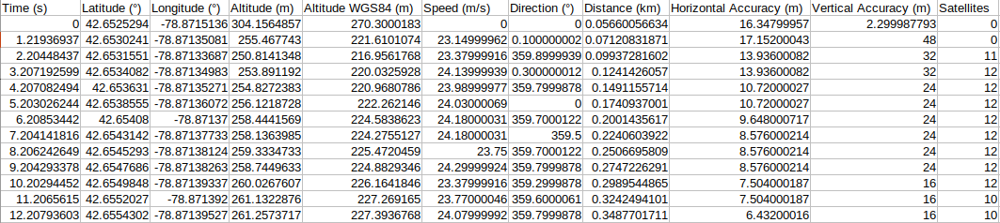
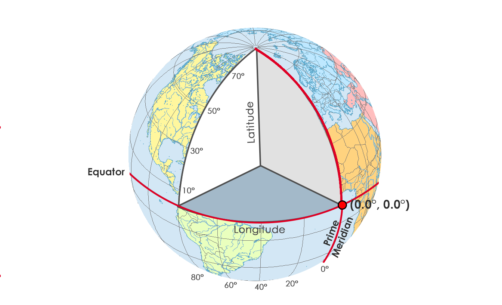
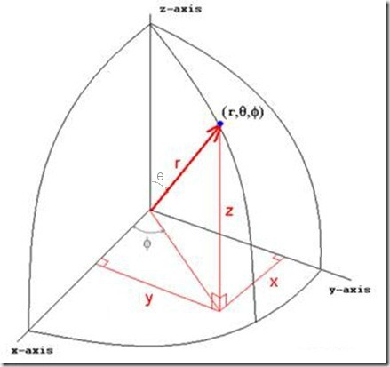

### CLEVER TITLE HERE

## 

### Motivation

In a society enriched by technology, it's inevitable that [`GPS`](https://en.wikipedia.org/wiki/Global_Positioning_System) will become increasingly commonplace.  Not far does one have to go to find an application, like Facebook or, oddly enough, [Angry Birds](https://www.vox.com/explainers/2019/5/7/18273355/angry-birds-phone-games-data-collection-candy-crush), that takes advantage of location information.  

The unavoidable reality is that this technology is ubiquitous, that privacy as a consumer is dwindling.  With the technology being everywhere, being ubiquitous, this also means that tools in order to analyze this data are more available.

Hence, tools like `phyphox` provide a means of recording your own coordinate data, exporting it in a rather limited (but understandable, given data format conventions) variety of file formats.  

Coordinate data is inherently fascinating; in its raw form, you know exactly where that person is based on the [geographical coordinate system](https://en.wikipedia.org/wiki/Geographic_coordinate_system).  However, as with any data, one set of points is rather boring; it tells you minimum information.  As such, it's more interesting to observe a change in this data.  For something like `GPS`, this is motion.  

Seeing how position changes as a function of a generic coordinate system (and predicting it, via fitting algorithms) is the most obvious application of such data.  As such, this is the motivation of this project:  to observe how my location changes across different trips, all localized within a few miles of my residence.  We can also observe quantities such as velocity, acceleration, jerk, [snap, crackle, and pop](https://en.wikipedia.org/wiki/Fourth,_fifth,_and_sixth_derivatives_of_position).

### Background Information

Before we begin analyzing any data, it's important to establish some groundwork.

First, all data comes from [phyphox](https://phyphox.org/), an application that turns your smartphone into a "mobile lab."  There are a variety of experiments listed on their website, but the one we're most concerned with, of course, is their GPS experiment.  Really, all they do here is record your position as discrete variables of altitude (m), latitude (°), and longitude (°).  Alongside this, the standard deviation of horizontal and vertical position (m) are provided.  They also provide information on velocity and acceleration.   More information on this can be found on their website.

Second, the data for these results are provided in `CSV` and `Excel` formats.  I opt to use `CSV` because that data form is overall more accessible and less bulky.  

Third, most of the background data processing is done in my own custom made `.py` files.  For two reasons, really:  that the code is out of sight so more of the space can be used for discussion and that unit testing can be performed on some of the statistically invariant functions.  A deeper dive into this code (and the code in this notebook) can be found in the `readme` in the github. 

Fourth, all data can be found in the `data` folder and the figures in the `figures` folder.  This is an act of cleanliness.

#### Data

Once the data has been recorded over `phyphox`, it can be exported by a variety of means.  As mentioned, I opted to export as a `CSV`, since it's less bulky and far more accessible. 

Regardless, the data is formatted such that each column has a header and represents a different quantity.  The format of the `CSV` can be seen below:

 <b>Figure 1:  a table displaying some data native to the GPS export.  Each column is a different quantity representing data relevant to what GPS tracking would produce.</b>

I'll take this opportunity to describe what each quantity represents and why (or why not) it's useful in this experiment:

* Time:  this is consistent across most coordinate systems, so in that it's self explanatory.  It's of course useful, especially since each time step isn't uniform.  So, in any physical system time is a useful metric.
* Latitude:  this represents the angle of the poles, i.e. how many degrees from the North Pole.  In a spherical coordinate system, this is but one of three vital metrics needed in order to understand position.  As such, it is useful.
* Longitude:  this represents the angle of the plane, which is perpendicular to the poles.  This is the second metric needed in order to describe position.  It is useful for the same reason as latitude.
* Altitude:  this describes distance above sea level, perpendicular to the plane that longitude is measured from.  An altitude of zero would suggest that the person is at or in the sea.  This is not to be confused with absolute altitude, which measures distance between the object and the ground.  Since this is the third metric for position, this is also useful.
* Altitude WGS84: this is just altitude adjusted for the eccentricity of the Earth's shape using the WGS84 system [1].  It's not useful, since in my work I assume that the Earth is not an oblate spheroid, but a perfect sphere.
* Speed:  this is the directionless velocity $|v|^2$ produced by these measurements.  Since it's a magnitude of the measurements and not a vector decomposition, it is not particularly useful unless the user would like to predict $|v|^2$ and compare to these measurements (at least for this experiment).
* Direction:  this is the angle that the velocity is moving.  This can be used to decompose speed into the vector form.  Since I'm only predicting position, velocity as a measure is not needed unless the user wishes to predict velocity or generate a time-specific equation of motion.  However, translation between coordinate systems must be considered here.
* Distance:  the directionless distance $|s|^2$ produced by these measurements.  Like velocity, this doesn't tell us much unless decomposed using direction.  I opt not to use this measurement, as I define my own coordinate system which could contradict the results by not accounting for the translation.  The same applies to speed.
* Horizontal Accuracy:  this is the standard deviation of measurements in the $x$ and $y$ coordinates.  This is useful in adjusting $\chi^2$ to account for the reliability of the measurement.  Primarily, these accuracies occur due to errors on the system level that the user can't avoid, such as the GPS satellites own accuracy.
* Vertical Accuracy:  similar to horizontal accuracy, but for the $z$ coordinates.  It is useful for the same reason.
* Satellites:  this tells you how many GPS satellites were involved in producing that measurement.  More satellites result in more measurements, which increases the density of those measurements.  So, it gives you a more focused answer at the cost of measurements being spread a bit more.   It is desirable to void the results where there are no satellites as the truth to the measurement cannot be spoken to.

As such, the measurements I wish to include are time, latitude, longitude, altitude, horizontal accuracy, and vertical accuracy.  From this,  I can develop my own coordinate system for this experiment.   Although, the number of satellites is used in cleansing the data such that measurements of $0$ are disregarded.  

### Theory

##### _Geographical to Cartesian Coordinate Systems_

Consider that position data is recorded by three variables:  altitude, latitude, and longitude.   The units provided by `phyphox` are meters, degrees, and degrees.  Really, there's only a slight difference between those conventions and spherical coordinates.  As such, I'll denote these $z$, $\theta$, and $\phi$ respectively.   A simple illustration of the geographical coordinate system can be seen below:

<b>Figure 2:  an illustration of the geographical coordinate system as projected onto Earth.  [2]</b>

However, the most important consideration here is that the Earth is not a perfect sphere.  Rather, it is an [oblate spheroid](https://simple.wikipedia.org/wiki/Oblate_spheroid) or, simply put, a sphere with eccentricity greater than zero.  So, the closed form conversion to a Cartesian coordinate system isn't quite a reflection of the spherical conversion.  

But, for the purposes of this project, I opt to work under the assumption that the Earth _is_ a perfect sphere.  This is because the distances covered in the data are not large enough such that the eccentricity of the Earth are observed.  After all, travel outside of the country is quite heavily restricted right now. 

With that, we can observe the projection of the spherical coordinate system onto the Cartesian coordinate system:

 <b>Figure 3:  the spherical coordinate system projected onto the Cartesian coordinate system.  [3]</b>

The conversion between spherical and Cartesian are then given by the generic equations

* $x = r\cos\phi\sin\theta$
* $y = r\sin\phi\sin\theta$
* $z = r\cos\theta$

where $r = \sqrt{x^2 + y^2 + z^2}$.  The conversion from geographical to Cartesian is then simplified.  Of those equations, most remain the same.  However, consider the transformation $\theta \to \theta - \dfrac{\pi}{2}$, since $\theta$ in geographical is defined by another vertex.  But, since they're right triangles, we know that it'll just be that subtraction to get the other angle.  

Another important consideration is that $\sin\left(\theta - \dfrac{\pi}{2}\right) = \cos\theta$  since they're similar functions, shifted by a factor of $\dfrac{\pi}{2}$.  The geographical coordinate system conversion is then:

* $x = r\cos\phi\cos\theta$
* $y = r\sin\phi\cos\theta$
* $z = r\cos\theta$

This allows us to convert the `phyphox` data to a form people more easily understand.  Of course, a quick Google search will produce the answers they desire, but the intent is for this to be readable from start to finish with introductory science knowledge.  

##### _Differential Position_

Once the data has been converted to a typical Cartesian system, the issue then arises that, for an ordinary person, these measurements still don't have a definitive meaning.   What I mean by that is someone cannot easily interpret what 300 meters in $x$ means.  Of course, something like altitude, $z$ , is a bit easier to interpret, since we have conventions for altitude as is.  

As such, I intend to introduce the quantity $s$, composed of $s_i$ which represents any element of the position vectors of $x, y, z$.  In doing so, I redefine $x, y, z$ from a continuous set of positions to a discrete set of positions, such that they can be indexed by the variable $i$.  Since the data is already vectorized, this is a sensible change.  

Hence, $(x, y, z) \to (x_i, y_i, z_i)$, $i \in \{0, 1, 2, \dots, N - 1\}$ where $N$ is the size of the data.  With this, we can introduce a means to interpret the data as the distance from the starting point.   Normally, this would be defined as $ds(t) = s(t) - s(0)$, where $ds(t)$ represents the distance from the starting point at time $t$.  However, since the data has been discretized we can redefine the quantity to be $ds_i = s_i - s_0$ or by its components:

* $dx_i = x_i - x_0$
* $dy_i = y_i - y_0$
* $dz_i = z_i - z_0$

This effectively shifts the data such that the starting point begins at the Cartesian origin, $(0, 0, 0)$.  It is important to note that it doesn't fundamentally transform the data, as in the shape and trend of the data is the same (but shifted).  However, in physical interpretation, it is easier to understand that I'm 10 meters from where I started than I'm at 300 meters.  Of course, we also have the discretized time vector $dt_i = t_i - t_0$.  However, the data begins at $t_0 = 0$ seconds in almost all cases.  See Appendix A for more on this.

We could simplify this further by taking the absolute value of the quantity $ds_i$, but preserving direction is important when it comes to examining stuff like velocity and acceleration.  In simplifying information, it's important to still be able to retrieve important qualities and taking the absolute value deprives us of perhaps one of the most consequential physics properties:  direction.

##### _Time Equations of Motion_

Since the data is in Cartesian format, the equations of motion can be easily derived.  First, we acknowledge that $F = m\ddot s = ma$, where $F$ is an arbitrary force, $m$ is the mass of the system, $\ddot s$ is the acceleration of the system, and $a$ is an acceleration constant.  This is an extension of [Newton's Law of Motion](https://www.grc.nasa.gov/www/k-12/airplane/newton.html).  Since we're not in free-fall (I would hope so) $a \neq g$ such that $g$ is the acceleration due to gravity.  Here, we also assume that the force is a constant and not subject to [Newton's Law of Universal Gravitation](https://en.wikipedia.org/wiki/Newton%27s_law_of_universal_gravitation).  This is because that function is dependent on $r$ in and, for this experiment, $dr \approx 0$ (due to distances inconsequentially changing) such that no acceleration would be observed, which is contrary to real-life motion.  After all, speeding limits do change depending on the location, which requires some form of acceleration.

Then, the acceleration is something that must be experimentally determined.  That'll be addressed later.  We can then derive the velocity of the system by integrating both sides such that

* $m\ddot s = m\dfrac{dv}{dt} = ma$
* $dv = adt$
* $\int_{v_0}^{v} dv = \int_{t_0}^{t} adt$
* $v - v_0 = a(t - t_0)$
* $v = a(t - t_0) + v_0$

However, by convention we define $t_0$ = 0 seconds such that $v = at + v_0$ where $v_0$ is the initial velocity and $v$ is the velocity of the system.  We can further take advantage of the fact that $v = \dfrac{ds}{dt}$ such that

* $\dfrac{ds}{dt} = at + v_0$
* $ds = (at + v_0)dt$
* $\int_{s_0}^{s} ds = \int_{t_0}^t (at' + v_0)dt$
* $s - s_0 = \frac{1}{2}a(t^2 - t_0^2) + v_0(t - t_0)$
* $s = \frac{1}{2}a(t^2 - t_0^2) + v_0(t - t_0) + s_0$

Once again, we can take advantage of $t_0 = 0$ seconds, but also that $s_0 = 0$ meters from us shifting the coordinate system.  As such, $s(t) = \frac{1}{2}at^2 + v_0t$.  We can then generalize this for our coordinate system such that:

* $x(t) = \frac{1}{2}a_x t^2 + v_{x}t$
* $y(t) = \frac{1}{2}a_yt^2 + v_yt$
* $z(t) = \frac{1}{2}a_z t^2 + v_zt$

If we wish to include a higher-order term such as jerk, methodology can be [found here](https://en.wikipedia.org/wiki/Jerk_(physics)).  With that, we can make decisions on the appropriate fit such that it follows the form of this equation and, thus, the physics.

##### _Fitting the Time Equations_

Consider that in the previous section we deduced that $s(t) = \frac{1}{2}at^2 + v_0t$.  This motion takes on the form of a quadratic equation.  If we generalize it further, we can state that $s(t) \approx c_2 t^2 + c_1 t + c_0 = f(t)$, where $c_n$ represents a constant associated with that motion.  $c_0$, for example, is related to the initial position, $c_1$ the initial velocity, etc.  

Then, for a set of points $P$ such that size($P$) $> N + 1$, where $N$ is the highest order, we can utilize the fact that we can generate a matrix $T\vec{c}$ of size $N \times$ size($P$), which linearizes the equations.  Thus,

$T\vec{c} = \begin{bmatrix}c_0 + c_1 t_1 + c_2 t_1^2 \\ c_0 + c_1 t_2 + c_2 t_2^2 \\ \dots\dots\dots\dots\\ c_0 + c_1 t_P + c_2 t_P^2\end{bmatrix}$     

which can be further broken down into $T$ and $\vec{c}$ by factoring out the constants such that

$T = \begin{bmatrix} 1 & t_1 & t_1^2 \\ 1 & t_2 & t_2^2 \\ \dots&\dots&\dots\\1 & t_P & t_P^2\end{bmatrix}$

$\vec{c} = \begin{bmatrix} c_0 \\ c_1 \\ c_2\end{bmatrix}$

Of course, this can be generalized to higher dimensions, but for our focus this is the highest it should go.  But this begs the question, what about the solutions, $\vec{s}$? These can also be generalized in the same way such that

$\vec{s} = \begin{bmatrix} s_1 \\ s_2 \\ \dots \\ s_P \end{bmatrix}$

We then have the vectorized equation $T\vec{c} = \vec{s}$.  This is a [Vandermonde Matrix](https://en.wikipedia.org/wiki/Vandermonde_matrix).  However, since this matrix cannot be square (size $N \times N$ or $P \times P$) in order to have sufficient data , then we cannot apply Gaussian elimination without producing linear dependence.  But we can take advantage of the fact that a $(n \times m) \times (m \times n)$ matrix multiplication produces a $n \times n$ size matrix, whereas a ($n \times m$) $\times$ $(n \times q)$ multiplication produces a $n \times q$ size matrix.  

We can utilize this knowledge by multiplying both sides of the equation by the transpose of $T$, $T^T$, such that $A = T^T T$ and $\vec{b} = T^T \vec{s}$.  Thus, after applying this, we have $A\vec{c} = \vec{b}$, which can be row-reduced since the matrix is now non-singular (nonzero determinant) and square.   

Solving this equation then produces the constants from the original equation $s(t) \approx c_0 + c_1 t + c_2 t^2 = f(t)$ such that we now have an approximation to the position.  Typically, the error to this fit is not described by something akin to $\chi^2$ such that $\chi^2 = \sum_i^P [\dfrac{s(t_i) - f(t_i)}{\sigma_i}]^2$ , where $\sigma_i$ is the standard deviation associated with the measurement of $s(t_i)$.  Further, root-mean squared error is given by $RMSE = \sqrt{\frac{\chi^2}{P}}$.  Ultimately, these tells us the goodness of fit, but don't present themselves as a vectorization of that quantity.  

Alternatively, we can just observe $|s(t_i) - f(t_i)|$ vs. $t_i$ to see how the error trends at each vector element.   Since this is predicting real data (not an exact function), this measure won't really tells us much if we're looking to observe some trend in error.

Another common means of fitting raw data is producing a [Lagrange Interpolating Polynomial](https://mathworld.wolfram.com/LagrangeInterpolatingPolynomial.html).  This particular method is nice in that it has to pass through all the reference points by the equation 

$P_n(t) = \sum_j^n s(t_j) \Pi_{i \neq j}^{n - 1} \dfrac{t - t_i}{t_j - t_i}$

where $P_n(t)$ represents the interpolating polynomial with $n$ reference points. So, for enough points, it should exactly approximate the raw data.  However, this fails to represent the physical model, since a highly-accurate model would require many near $n$ points.  This would produce a near $t^n$ polynomial, which becomes a problem because the highest that we can observe on this scale is likely jerk, $\mathcal O(t^3)$.  So, although it may provide an accurate polynomial, it does not represent the physics of the system and doesn't tell us anything about physical constants such as $v_0$, $a$, etc.  

Further, I will not smooth the data by a Fourier transform because there is no periodicity to it.  Because of that, cleansing would not be algorithmic in most cases; rather, it would be case-by-case looking for inconsistencies in that particular data.  A better solution would be to follow the same path with the exact same initial conditions over and over again, then average the data.  However, even that isn't feasible since the data produced by `phyphox` doesn't have consistent time-steps such that you could match-up entries easily.  So, the average of $K$ trials is also ignored due to the structure of the data.  

As such, I opt to follow the least-squares path instead since the matrix is formed by the actual predicted equations of motion.  Further, if we were to opt to use 3 points, the choice in them is arbitrary.   In such a large set of data, the user has to choose which points to interpolate.  This can't really be optimized without a rigorous algorithm that the motion doesn't necessary fit in all cases.  Instead, least-squares makes that decision for you by producing the correct order for a physics polynomial while implementing all points.

### Appendix 

[A] Consider that the `phyphox` data is for the most part reliable.  However, depending on the phone and its operating system, there are some exceptions such that the data faces issues.  Namely, if the GPS experiment is started and it cannot ping the cellphone, then the first position will be the last known location.  I personally haven't observed this elsewhere in the time domain, so the fix for this is easy enough.  It does have standard deviation in the data such that you can reasonably adjust for mistakes, but it can't always be incorporated.  Overall, I've seen only but a few issues with time and position being misreported, but nothing that should affect the experiment since the data is cherrypicked as is.

### References

[1] https://confluence.qps.nl/qinsy/latest/en/world-geodetic-system-1984-wgs84-182618391.html

[2] https://gisgeography.com/decimal-degrees-dd-minutes-seconds-dms/

[3] https://rbrundritt.wordpress.com/2008/10/14/conversion-between-spherical-and-cartesian-coordinates-systems/

to-do:

fit based on simple quadratic motion, 

re-do data for 10 or so trials walking down jennings

fit based on x, y, z ? :) 

discussion
